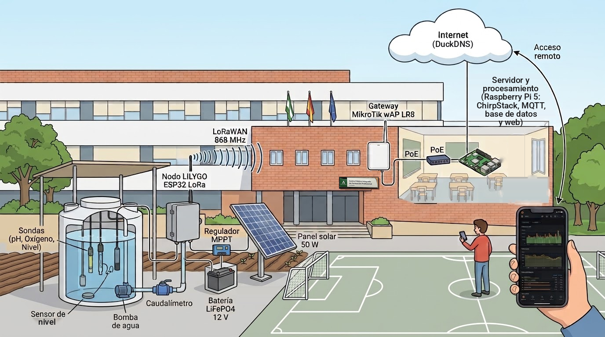
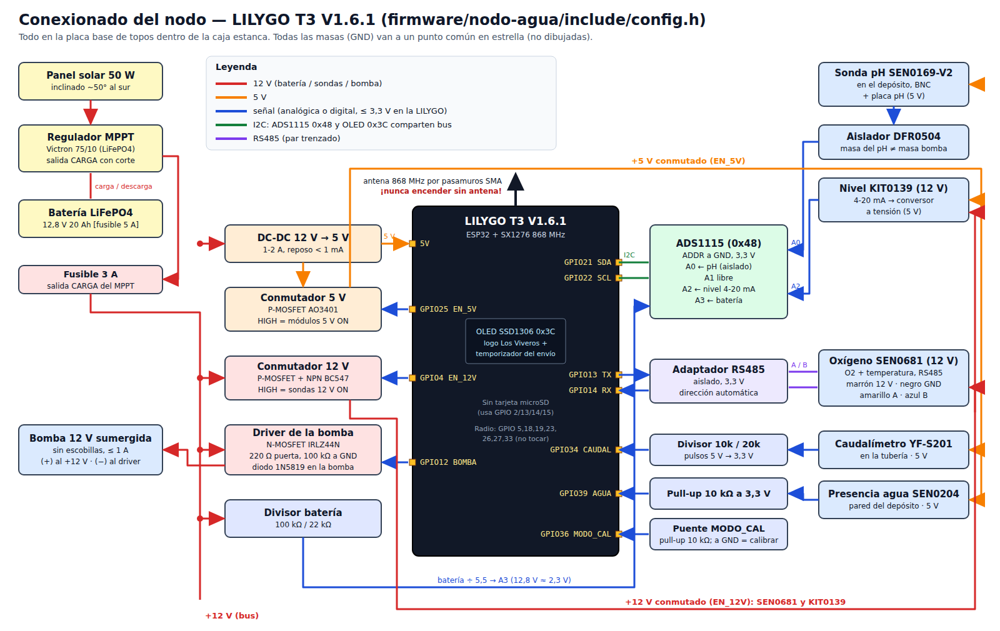
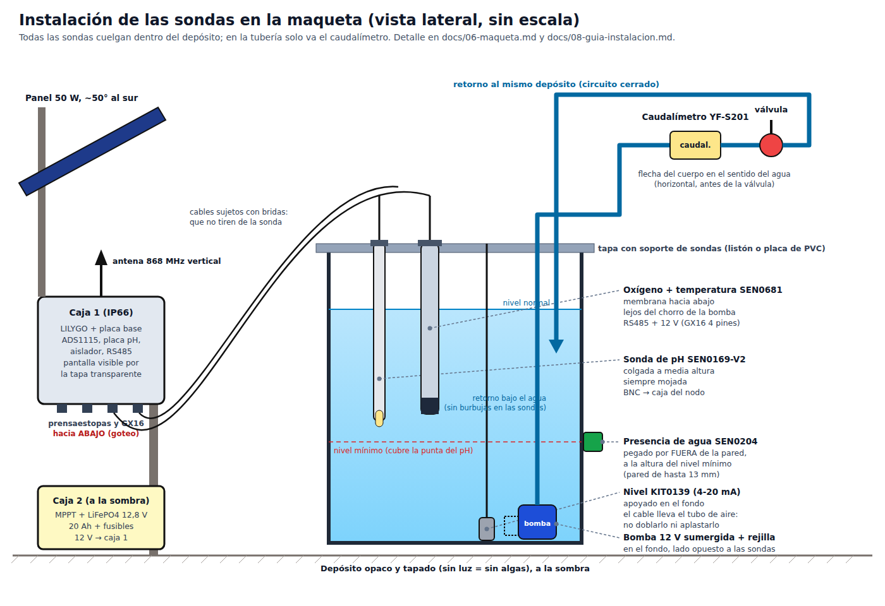
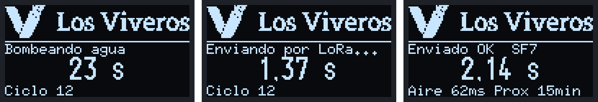
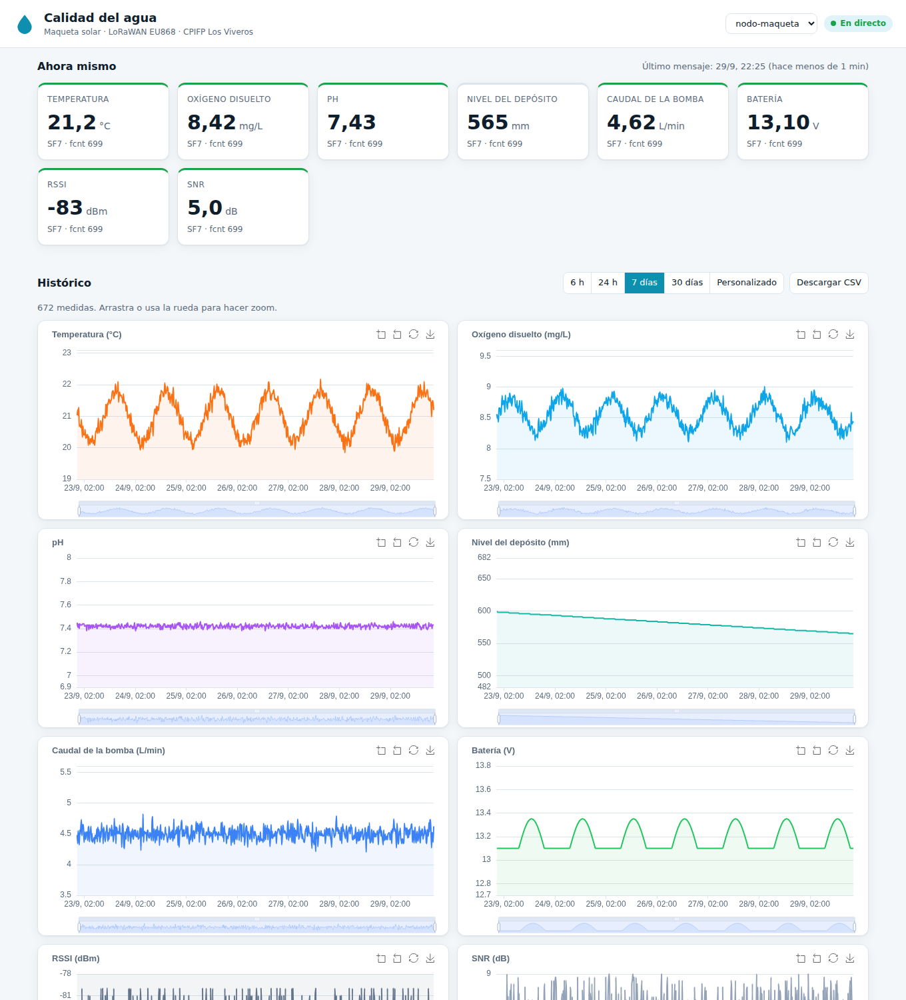
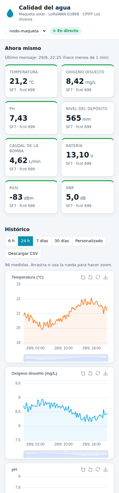

# TFG — Monitorización de la calidad del agua con LoRaWAN

Proyecto final del 2º curso de Sistemas de Telecomunicaciones e Informáticos (CPIFP Los Viveros, Sevilla).
Carlos Maraver Román y Rubén Trillo García.

Una maqueta exterior con energía solar mide el oxígeno disuelto, el pH, la temperatura, el nivel del depósito
y el caudal de la bomba. Envía los datos por LoRaWAN al gateway del edificio. La Raspberry Pi 5 lo hace todo:
servidor LoRaWAN, base de datos y una web con los datos en tiempo real y gráficas del histórico,
accesible desde Internet con DuckDNS.



## Por dónde empezar

**Para montarlo todo: [guía de instalación paso a paso](docs/08-guia-instalacion.md).**

| Tema | Documento |
|---|---|
| Plan del proyecto, fases y tareas pendientes | [`CLAUDE.md`](CLAUDE.md) |
| Material (lo que hay y lo que falta) | [`docs/01-lista-material.md`](docs/01-lista-material.md) |
| Lista de compra con enlaces para el centro | [`docs/07-lista-compra.md`](docs/07-lista-compra.md) · [hoja de cálculo](docs/07-lista-compra.xlsx) |
| Red: IPs, puertos, NAT, DuckDNS, seguridad | [`docs/02-arquitectura-red.md`](docs/02-arquitectura-red.md) |
| Conexionado del nodo e instalación de las sondas | [`docs/03-conexionado-nodo.md`](docs/03-conexionado-nodo.md) |
| Formato del mensaje LoRaWAN | [`docs/04-formato-payload.md`](docs/04-formato-payload.md) |
| Maqueta, ciclo de bombeo y energía solar | [`docs/06-maqueta.md`](docs/06-maqueta.md) |
| Índice de la memoria del TFG | [`docs/05-indice-memoria.md`](docs/05-indice-memoria.md) |
| Firmware de la LILYGO | [`firmware/nodo-agua/README.md`](firmware/nodo-agua/README.md) |
| Servidor en la Raspberry: instalación con un script (`raspberry/instalar.sh`) | [`raspberry/README.md`](raspberry/README.md) |
| Web desde Internet con DuckDNS (y qué pedir al coordinador TIC) | [`docs/09-guia-duckdns.md`](docs/09-guia-duckdns.md) |
| Pruebas sin hardware | [`pruebas/README.md`](pruebas/README.md) |

## Cómo está organizado

```
README.md                  ← esta página
CLAUDE.md                  ← plan maestro: arquitectura, reglas, fases y pendientes
docs/                      ← documentación (numerada en el orden de lectura)
  01 … 08 *.md
  07-lista-compra.xlsx     ← lista de compra en hoja de cálculo
  img/                     ← esquemas (.png y .svg editables) y capturas
firmware/nodo-agua/        ← código de la LILYGO (PlatformIO)
  include/  src/           ← configuración, sensores, LoRaWAN, pantalla OLED
  herramientas/            ← script para generar el logo de la pantalla
raspberry/                 ← todo el servidor
  instalar.sh              ← instala y deja lista la Raspberry de una vez
  docker-compose.yml       ← ChirpStack, Mosquitto, TimescaleDB, ingestor, web, Caddy, DuckDNS
  .env.example             ← plantilla de contraseñas (el .env de verdad no se sube)
  configuracion/ codec/ mosquitto/ db/ ingestor/ web/ caddy/ red/
  backup.sh
pruebas/                   ← pruebas que se pueden hacer en el PC sin hardware
```

Las claves y contraseñas nunca se suben: van en `firmware/nodo-agua/include/secrets.h` y `raspberry/.env`,
que están en `.gitignore` (se suben solo sus plantillas `*.example`).

## Imágenes

### Conexionado del nodo


### Sondas dentro del depósito


### Pantalla OLED del nodo
Logo de Los Viveros, fase del ciclo y temporizador del envío por LoRa.



### Web en tiempo real (captura con datos simulados)



